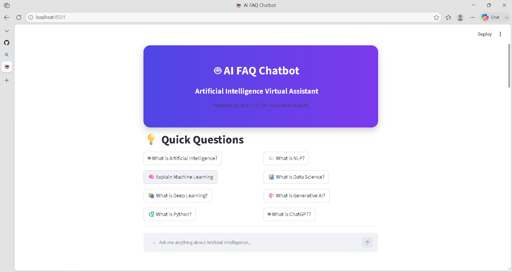
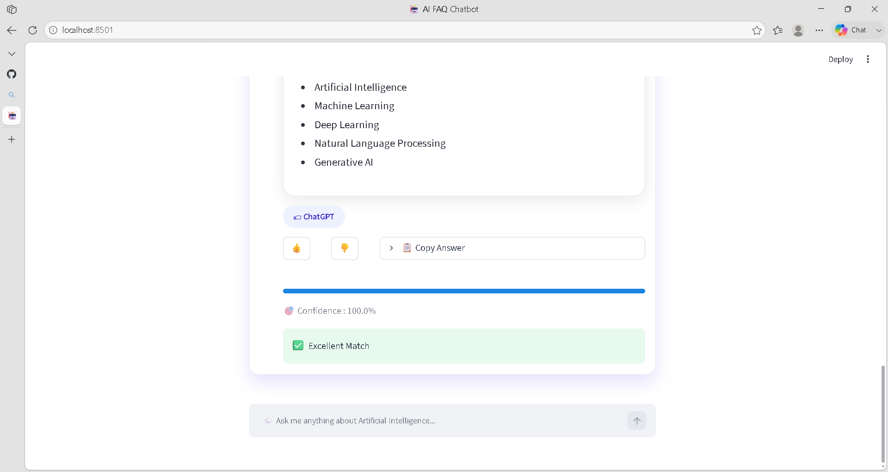

# 🤖 AI FAQ Chatbot

An AI-powered FAQ Chatbot built using **Python**, **Streamlit**, **Natural Language Processing (NLP)**, **TF-IDF**, and **Cosine Similarity**.

The chatbot answers questions related to **Artificial Intelligence**, **Machine Learning**, **Deep Learning**, **Natural Language Processing**, **Python**, **Data Science**, **Computer Vision**, **Generative AI**, and **ChatGPT** using a custom knowledge base. It features an interactive chat interface, quick question suggestions, confidence scoring, and a modern responsive UI.

---

# 📌 Project Information

- **Project Name:** AI FAQ Chatbot
- **Internship:** CodeAlpha Artificial Intelligence Internship
- **Task:** Task 2 – AI Chatbot for FAQs
- **Developer:** Sherin Y

---

# 🚀 Features

- 🤖 AI-powered FAQ Chatbot
- 💬 Interactive Chat Interface
- 🧠 NLP-based Question Processing
- 📚 Custom Knowledge Base
- ⚡ Fast Question Matching using TF-IDF
- 🎯 Confidence Score for Every Answer
- 📂 Category Identification
- 💡 Quick Question Buttons
- 👍 Like & 👎 Dislike Feedback Buttons
- 📋 Copy Answer Feature
- ✨ Typing Animation
- 🎨 Modern Glassmorphism UI
- 📱 Responsive Streamlit Interface
- 🔍 Supports AI, ML, DL, NLP, Python, Data Science, ChatGPT, Computer Vision and Generative AI topics

---

# 🛠️ Technologies Used

- Python
- Streamlit
- Scikit-learn
- Natural Language Toolkit (NLTK)
- TF-IDF Vectorizer
- Cosine Similarity
- JSON Knowledge Base
- HTML
- CSS

---

# 📂 Project Structure

```text
AI_FAQ_Chatbot/
│
├── app.py
├── chatbot.py
├── preprocess.py
├── requirements.txt
├── README.md
│
├── knowledge_base/
│   ├── artificial_intelligence.json
│   ├── machine_learning.json
│   ├── deep_learning.json
│   ├── data_science.json
│   ├── python.json
│   ├── nlp.json
│   ├── chatgpt.json
│   ├── generative_ai.json
│   └── computer_vision.json
│
└── assets/
```

---

# ⚙️ Installation

### Clone the Repository

```bash
git clone https://github.com/sheriny1507-s4/AI-FAQ-Chatbot.git
```

### Navigate into the Project

```bash
cd AI-FAQ-Chatbot
```

### Create Virtual Environment

Windows

```bash
python -m venv venv
```

Activate

```bash
venv\Scripts\activate
```

### Install Dependencies

```bash
pip install -r requirements.txt
```

---

# ▶️ Run the Application

```bash
streamlit run app.py
```

The application will automatically open in your browser.

---

# 🌟 How It Works

1. Open the AI FAQ Chatbot.
2. Type your question or select one of the Quick Questions.
3. The chatbot preprocesses the query using NLP.
4. TF-IDF converts the text into numerical vectors.
5. Cosine Similarity finds the most relevant question from the knowledge base.
6. The chatbot displays the best answer.
7. Confidence Score indicates how closely the question matches.
8. Users can Like, Dislike, or Copy the response.

---

# 📸 Screenshots


## 🏠 Home Page



---

## 💬 Chat Interface


---

## 📊 Confidence Score



---

## 💡 Quick Questions


!
# 💡 Future Enhancements

- 🔊 Read Aloud (Text-to-Speech)
- 🎤 Voice Input
- 🌐 Multi-language Support
- 🤖 Generative AI Integration
- 📝 Chat History Export
- 📄 PDF Knowledge Base Support
- 📸 Image Question Answering
- 🌙 Dark & Light Theme
- ❤️ User Feedback Analytics
- ☁️ Database Integration

---

# 🎯 Learning Outcomes

During this project, I learned:

- Natural Language Processing (NLP)
- Text Preprocessing Techniques
- TF-IDF Vectorization
- Cosine Similarity Algorithm
- Building AI Chatbots
- Streamlit Web Application Development
- Knowledge Base Design
- Interactive UI Development
- Python Programming
- GitHub Project Management

---

# 📋 Requirements

```text
streamlit
scikit-learn
nltk
numpy
pandas
gTTS
```

Install using

```bash
pip install -r requirements.txt
```

---

# 🧠 AI Concepts Covered

The chatbot currently supports questions related to:

- Artificial Intelligence
- Machine Learning
- Deep Learning
- Natural Language Processing
- Data Science
- Python Programming
- Computer Vision
- ChatGPT
- Generative AI

---

# 👨‍💻 Author

**Sherin Y**

BCA Graduate

Artificial Intelligence Enthusiast

Data Analytics | Artificial Intelligence | Machine Learning | NLP

---

# 📜 Internship Details

This project was developed as part of the **CodeAlpha Artificial Intelligence Internship Program**.

### Task Completed

✅ AI FAQ Chatbot

---

# ⭐ Support

If you found this project helpful, please consider giving it a ⭐ on GitHub.

---

# 📄 License

This project is developed for educational and internship purposes.
